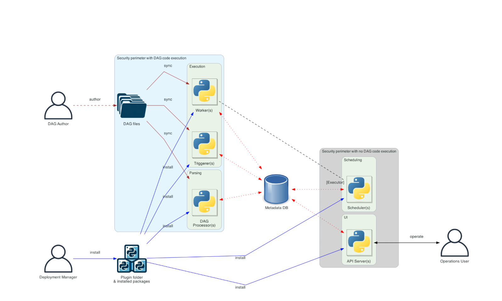

# Explain Airflow Setup

**1\. Deployment architecture**
---------------------

*   **Separate Dag processing architecture ([Link documents](https://airflow.apache.org/docs/apache-airflow/stable/core-concepts/overview.html#separate-dag-processing-architecture))**
*   

**2\. Build image**
-------------------
* I defined tasks at `conf/Taskfile.yml`, it helps to build images easily

| Component / Step                                                                 | Purpose                     | Explanation                                                                                                                                      |
| -------------------------------------------------------------------------------- | --------------------------- | ------------------------------------------------------------------------------------------------------------------------------------------------ |
| **FROM apache/airflow:3.1.3-python3.12**                                         | Base image                  | Uses official Airflow 3.1.3 with Python 3.12 as starting point                                                                                   |
| **ARG AIRFLOW_VERSION, PYTHON_VERSION, AIRFLOW_UID**                             | Build arguments             | Allow customization of Airflow version, Python version, and container user ID                                                                    |
| **USER 0**                                                                       | Switch to root              | Needed to install system packages                                                                                                                |
| **RUN apt-get update && apt-get install -y gcc heimdal-dev**                     | Install system dependencies | Compiler and Kerberos dev libraries required for some Python packages                                                                            |
| **USER ${AIRFLOW_UID}**                                                          | Switch back to Airflow user | Ensures proper file permissions in container                                                                                                     |
| **RUN python -m pip install --upgrade pip**                                      | Upgrade pip                 | Ensures latest pip for package installation                                                                                                      |
| **COPY ./dependencies /tmp/**                                                    | Copy dependency files       | Internal and external Python package lists for installation                                                                                      |
| **ENV / vars (AIRFLOW_VERSION, PYTHON_VERSION, AIRFLOW_UID, IMAGE, BUILD_ARGS)** | Environment variables       | Define Airflow version, Python version, user ID, Docker image tag, and build arguments                                                           |
| **External requirements (paramiko, pytest, pytest-mock)**                        | Install additional packages | Packages needed for SFTP and testing                                                                                                             |
| **Download constraints file**                                                    | Lock dependencies           | Uses official Airflow constraints for Python version to ensure compatibility                                                                     |
| **RUN pip install -r internal & external requirements -c constraints**           | Install Python packages     | Internal requirements supported by Airflow (e.g., `apache-airflow-providers-sftp`) and external packages with constraint file to avoid conflicts |
| **tasks: build**                                                                 | Build image                 | Runs `docker build` with pull, progress, and tag options                                                                                         |
| **tasks: push**                                                                  | Push image                  | Uploads image to registry (`ghcr.io/nhuantho/docker/airflow`)                                                                                    |
| **tasks: publish**                                                               | Build + push                | Combines build and push steps                                                                                                                    |
| **tasks: run**                                                                   | Run container               | Starts container interactively for testing                                                                                                       |

**3\. Components**
------------------

| Component                 | What It Is                     | What It Does                                                               | Why It Is Needed                              |
| ------------------------- | ------------------------------ | -------------------------------------------------------------------------- | --------------------------------------------- |
| **postgres**              | Database                       | Stores metadata: DAGs, task instances, logs, connections, variables, users | Airflow *cannot run* without a metadata DB    |
| **redis**                 | Message broker                 | Stores “tasks to execute”. Celery workers pull tasks from here             | Required when using **CeleryExecutor**        |
| **airflow-apiserver**     | Airflow API web service        | Provides REST APIs for triggering DAGs, managing tasks, querying Airflow   | Used by UI, CLI, or external systems          |
| **airflow-scheduler**     | Core scheduler                 | Reads DAGs, schedules tasks, sends tasks to Redis                          | Decides *what runs and when*                  |
| **airflow-dag-processor** | DAG parser                     | Offloads DAG parsing from Scheduler for better performance                 | Makes DAG loading faster and more scalable    |
| **airflow-worker**        | Celery worker                  | Actually runs your tasks (operators, python code, Bash, etc.)              | Executes tasks that Scheduler queues in Redis |
| **airflow-triggerer**     | Asynchronous trigger service   | Runs async operators (e.g., sensors) without blocking workers              | Improves concurrency & performance            |
| **airflow-init**          | Initialization container       | Performs DB migrations, creates admin user, sets folder permissions        | Runs once at startup before others            |
| **airflow-cli**           | Airflow command-line container | Lets you run `airflow X` commands inside the environment                   | Useful for debugging & manual operations      |
| **flower**                | Web UI for Celery              | Shows queue status, worker activity, and task execution                    | Helps monitor Celery worker performance       |

**4\. Environment Variables**
-----------------------------

| ENV Var                                           | Meaning                                       |
| ------------------------------------------------- | --------------------------------------------- |
| `AIRFLOW__CORE__EXECUTOR=CeleryExecutor`          | Use distributed worker executor               |
| `AIRFLOW__CORE__AUTH_MANAGER`                     | FAB authentication (default Airflow login)    |
| `AIRFLOW__DATABASE__SQL_ALCHEMY_CONN`             | Metadata DB connection to Postgres            |
| `AIRFLOW__CELERY__RESULT_BACKEND`                 | Where task results are stored (Postgres)      |
| `AIRFLOW__CELERY__BROKER_URL`                     | Redis as queue for Celery workers             |
| `AIRFLOW__CORE__FERNET_KEY`                       | Encrypt secrets (empty = auto-generated)      |
| `AIRFLOW__CORE__DAGS_ARE_PAUSED_AT_CREATION=true` | New DAGs start paused                         |
| `AIRFLOW__CORE__LOAD_EXAMPLES=false`              | Do not load example DAGs                      |
| `AIRFLOW__CORE__EXECUTION_API_SERVER_URL`         | Where API server exposes execution endpoint   |
| `AIRFLOW__SCHEDULER__ENABLE_HEALTH_CHECK=true`    | Enables scheduler health check endpoint       |
| `AIRFLOW_CONFIG=/opt/airflow/config/airflow.cfg`  | Use custom config                             |
| `AIRFLOW_CONN_SFTP_SOURCE`                        | Predefined Airflow connection for SFTP source |
| `AIRFLOW_CONN_SFTP_TARGET`                        | Predefined Airflow connection for SFTP target |

