# Guideline And Result

**1\. Build airflow**
---------------------

*   Run: docker compose up (-d)
*   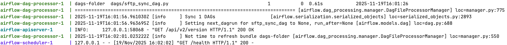

*   Access `localhost:8080` and require login, type `airflow` to `Username and Password` and push `Sign In`
*   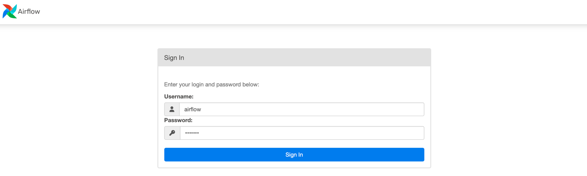
*   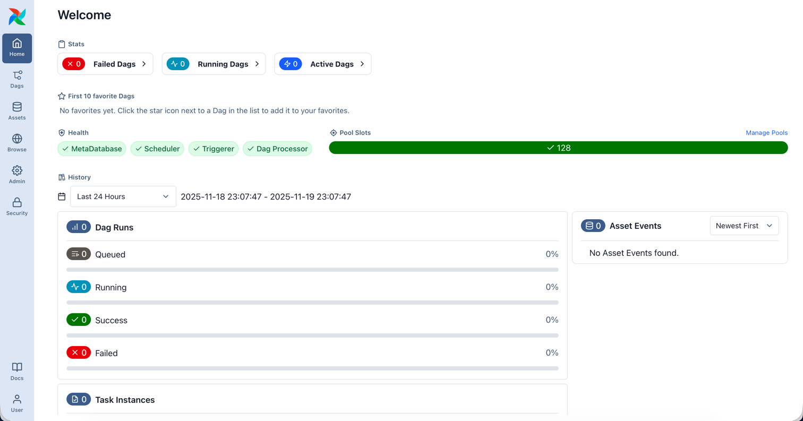

**2\. Test Scenarios**
---------------------
### Overview
*   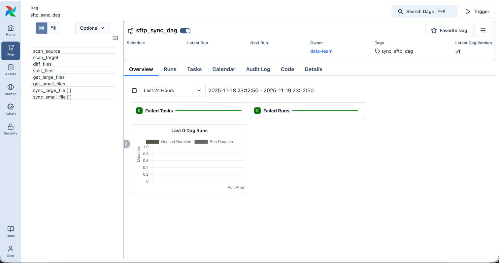

*   Push `Trigger` on the top-left of sftp_sync_dag screen, and then push Trigger
*   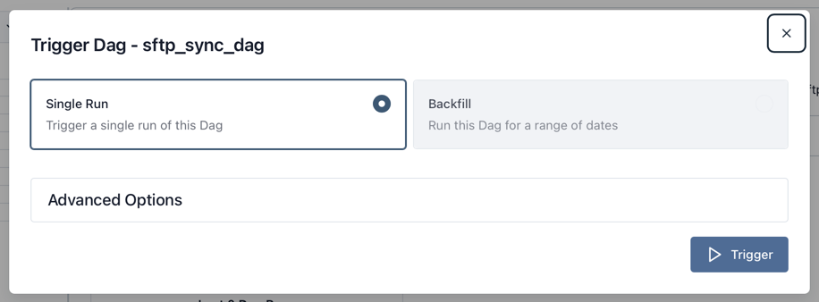
*   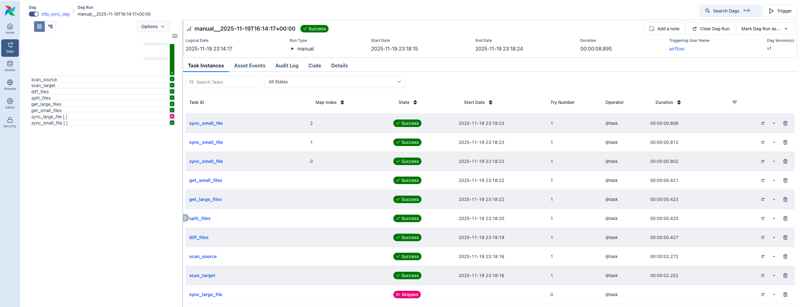

### Results
*   **Happy case**

| # | Scenario                   | Task(s)                  | Result (Check logs of the specific task)                                                                                                                                                                                                                                                                         | 
| - |----------------------------|--------------------------|------------------------------------------------------------------------------------------------------------------------------------------------------------------------------------------------------------------------------------------------------------------------------------------------------------------|
| 1 | Detect files on source     | `scan_source`            | Check `INFO - List files: ` 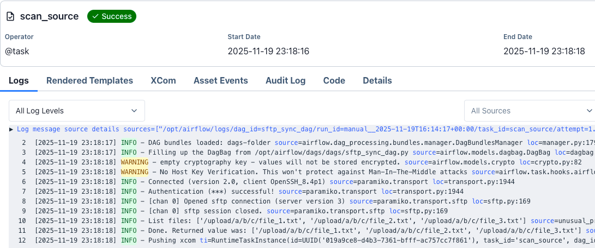                                                                                                                                                                                                                                       |
| 2 | Detect files on target     | `scan_target`            | Check `INFO - List files: ` 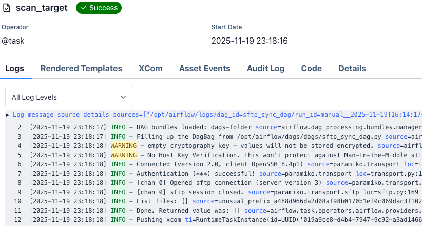                                                                                                                                                                                                                                       |
| 3 | Calculate diff files       | `diff_files`             | Check `INFO - New files: ` 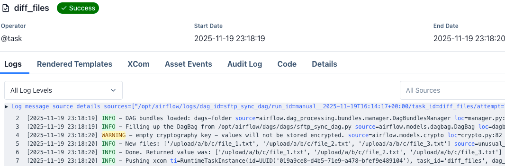                                                                                                                                                                                                                                         |
| 4 | Split files                | `split_files`            | Check `INFO - Small files: ` Check `INFO - Large files: ` 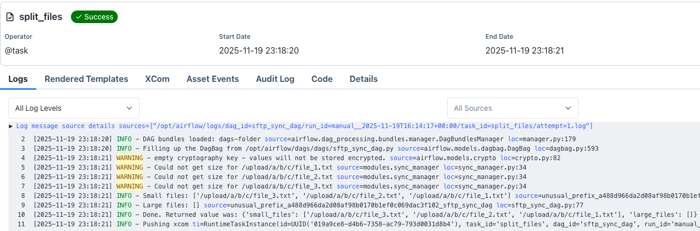                                                                                                                                                                                                     |
| 5 | Extract small files        | `get_small_files`        | Check `INFO - Done. Returned value was: ` 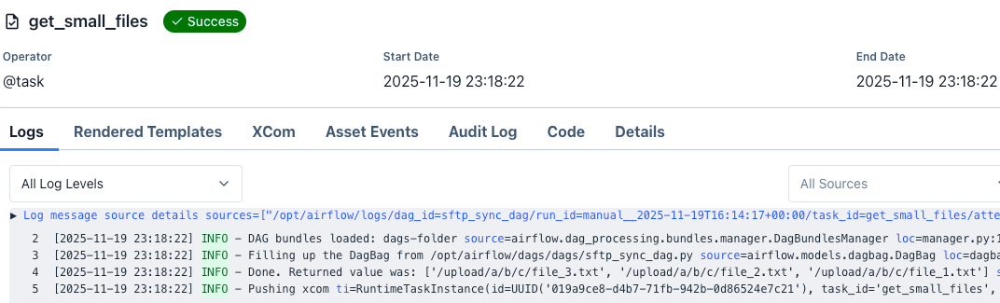                                                                                                                                                                                                                     |
| 6 | Sync small files           | `sync_small_file`        | There are three tasks 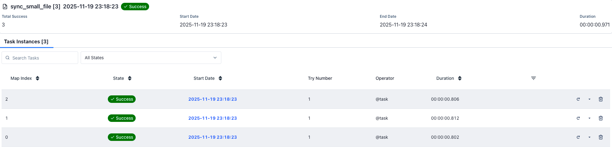 See detail a task, and check `INFO - Synced: ` 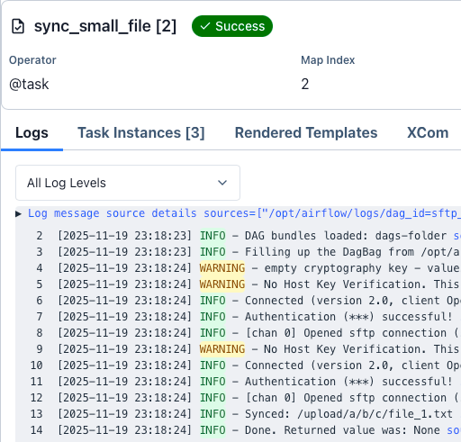                                                                                                                   |
| 7 | Check files in sftp-target |  | Run: `docker exec -it sftp-ingestion-pipeline-sftp-target-1 ls /home/sftpuser/upload/a/b/c` 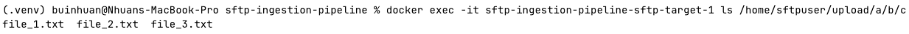 Run: `docker exec -it sftp-ingestion-pipeline-sftp-target-1 cat /home/sftpuser/upload/a/b/c/file_1.txt` 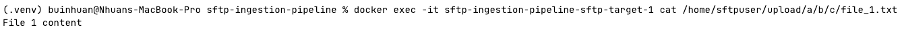 |

*   **Unidirectional sync**

| # | Scenario                                                          | Task(s)                  | Result (Check logs of the specific task)                                                                                                                                                                                                                                                                        | 
|---|-------------------------------------------------------------------|--------------------------|-----------------------------------------------------------------------------------------------------------------------------------------------------------------------------------------------------------------------------------------------------------------------------------------------------------------|
| 1 | Delete `/upload/a/b/c/file_1.txt` on source, and then trigger dag |                     | Run: `docker exec -it sftp-ingestion-pipeline-sftp-source-1 rm -rf /home/sftpuser/upload/a/b/c/file_1.txt` 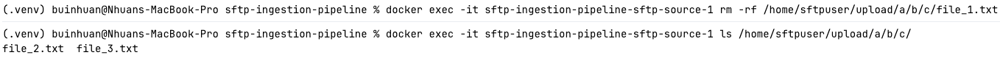 Did not have new files so `sync_small_file` was skipped 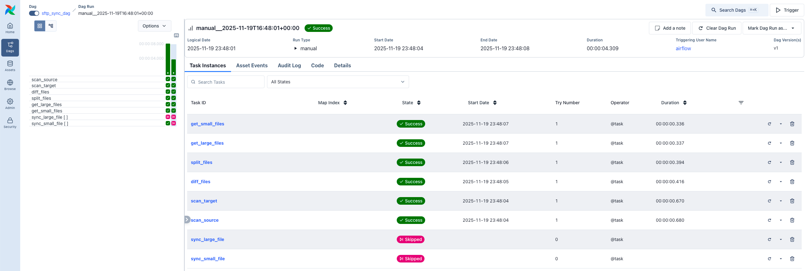                                          |
| 2 | Detect files on source                                            | `scan_source`            | Check `INFO - List files: ` 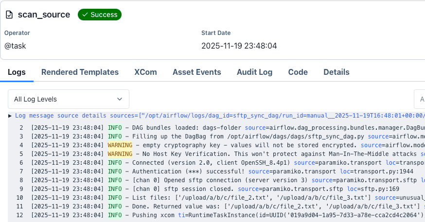                                                                                                                                                                                                                                    |
| 3 | Detect files on target                                            | `scan_target`            | Check `INFO - List files: ` 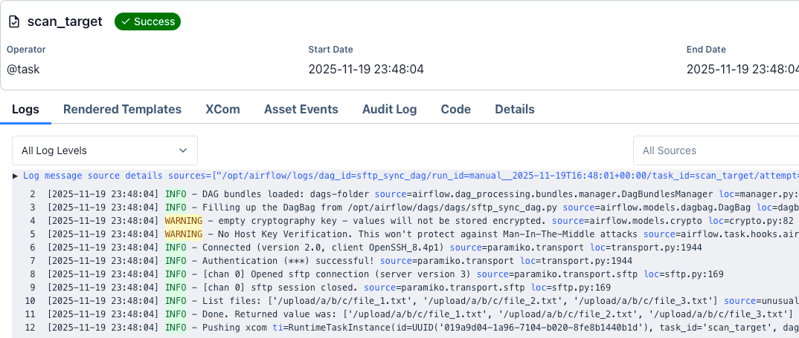                                                                                                                                                                                                                                    |
| 4 | Calculate diff files                                              | `diff_files`             | Check `INFO - New files: ` 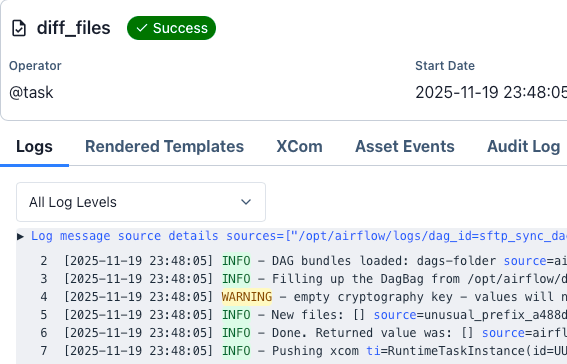                                                                                                                                                                                                                                      |
| 5 | Split files                                                       | `split_files`            | Check `INFO - Small files: ` Check `INFO - Large files: ` 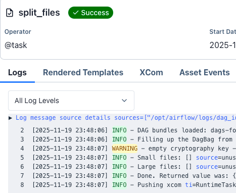                                                                                                                                                                                                  |
| 6 | Extract small files                                               | `get_small_files`        | Check `INFO - Done. Returned value was: ` 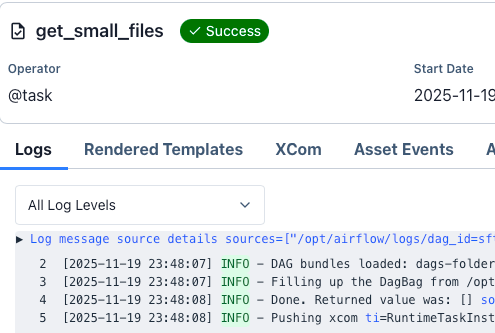                                                                                                                                                                                                                  |
| 7 | Check files in sftp-target (Not change)                           |  | Run: `docker exec -it sftp-ingestion-pipeline-sftp-target-1 ls /home/sftpuser/upload/a/b/c`  `Run docker exec -it sftp-ingestion-pipeline-sftp-target-1 cat /home/sftpuser/upload/a/b/c/file_1.txt`  |

*   **Incremental sync**

| # | Scenario                                                       | Task(s)                  | Result (Check logs of the specific task)                                                                                                                                                                                                                                       | 
|---|----------------------------------------------------------------|--------------------------|--------------------------------------------------------------------------------------------------------------------------------------------------------------------------------------------------------------------------------------------------------------------------------|
| 1 | Add `/upload/a/b/c/file_4.txt` on source, and then trigger dag |                     | Run: `docker exec -it sftp-ingestion-pipeline-sftp-source-1 bash -c 'echo "File 4 content" > /home/sftpuser/upload/a/b/c/file_4.txt'` 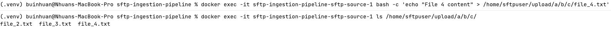 Had a new file so `sync_small_file` ran 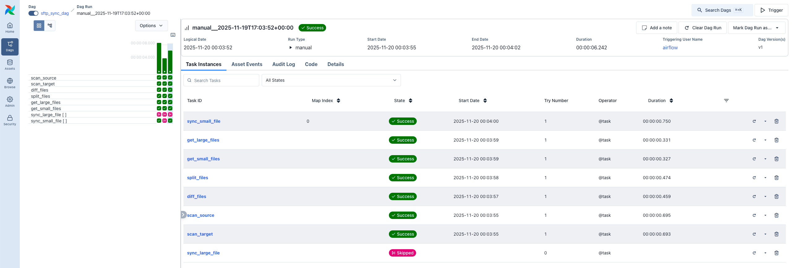 |
| 2 | Detect files on source                                         | `scan_source`            | Check `INFO - List files: ` 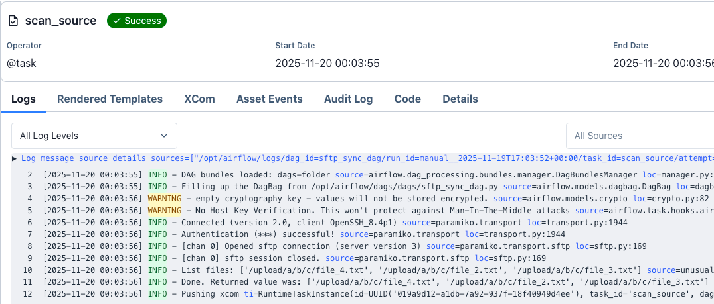                                                                                                                                                                                                   |
| 3 | Detect files on target                                         | `scan_target`            | Check `INFO - List files: ` 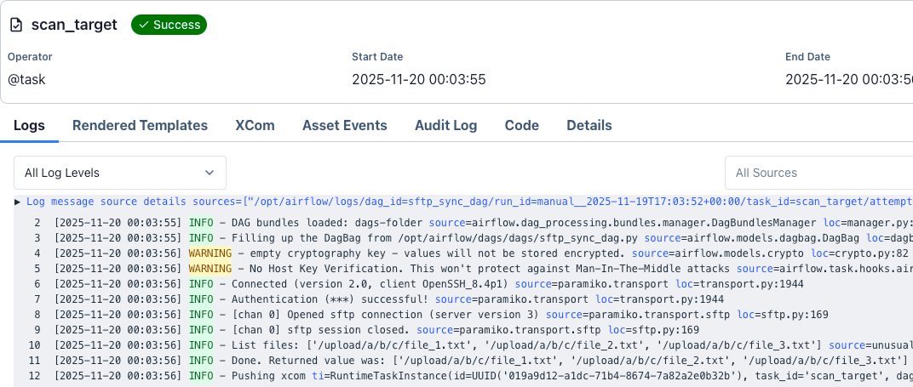                                                                                                                                                                                                   |
| 4 | Calculate diff files                                           | `diff_files`             | Check `INFO - New files: ` 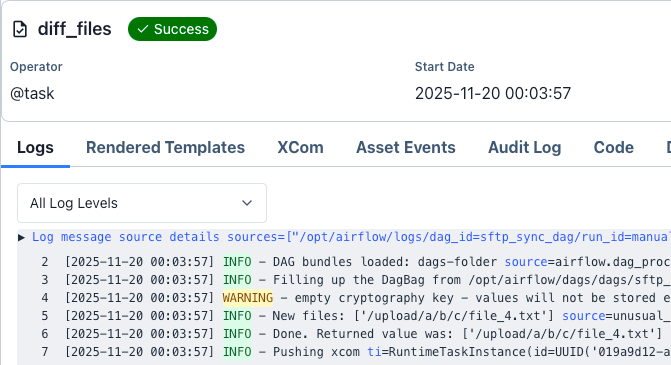                                                                                                                                                                                                     |
| 5 | Split files                                                    | `split_files`            | Check `INFO - Small files: ` Check `INFO - Large files: `                                                                                                                                                                  |
| 6 | Extract small files                                            | `get_small_files`        | Check `INFO - Done. Returned value was: ` 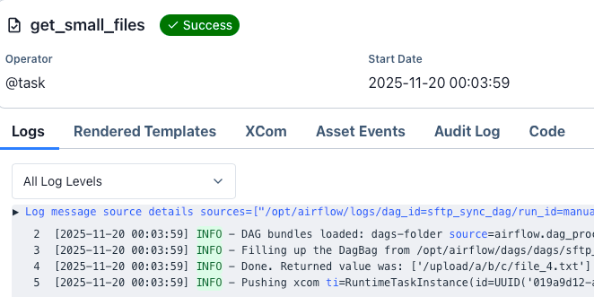                                                                                                                                                                                 |
| 7 | Sync small files                                               | `sync_small_file`        | There is one task 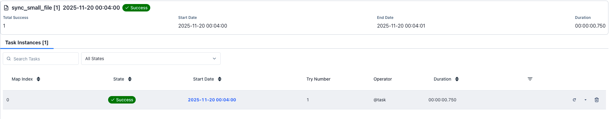 See detail a task, and check `INFO - Synced: ` 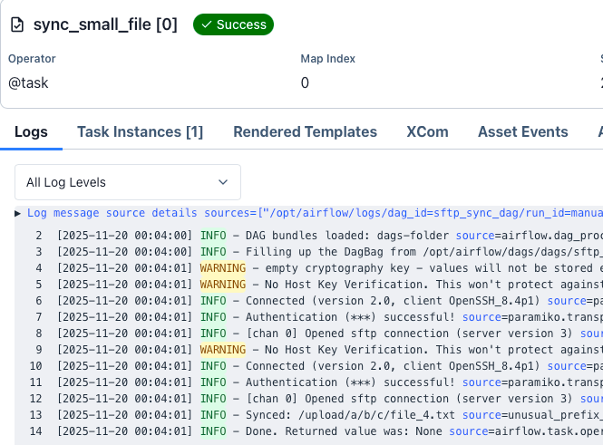                                                                                 |
| 8 | Check files in sftp-target (a new file_4.txt)                  |  | Run: `docker exec -it sftp-ingestion-pipeline-sftp-target-1 ls /home/sftpuser/upload/a/b/c` `Run docker exec -it sftp-ingestion-pipeline-sftp-target-1 cat /home/sftpuser/upload/a/b/c/file_4.txt` 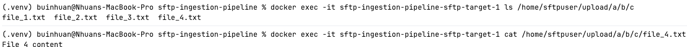                  |